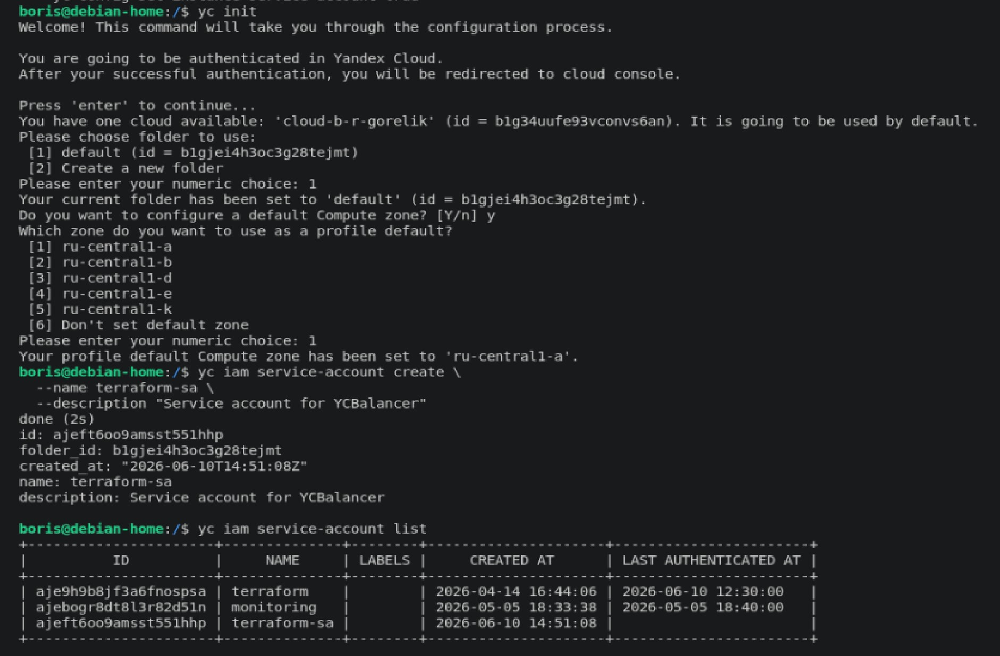
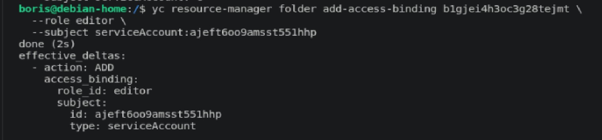
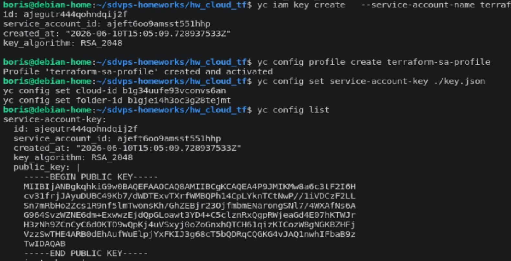
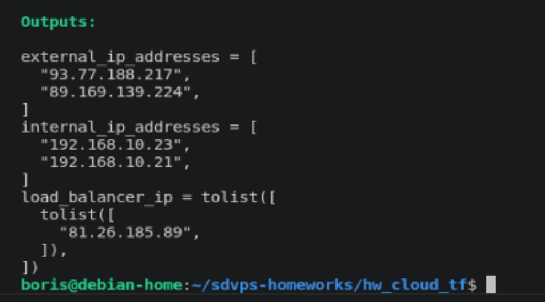
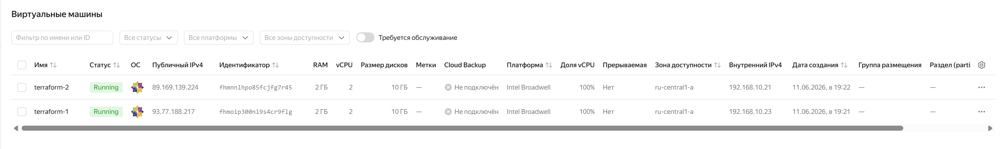
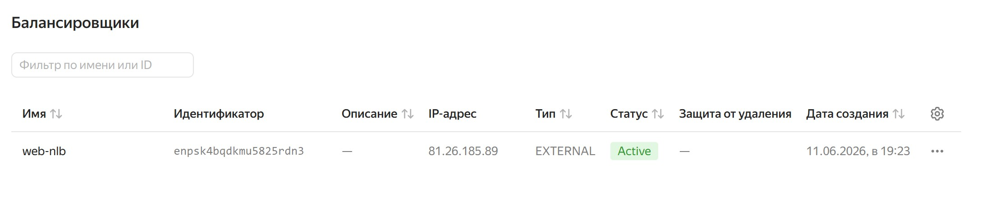
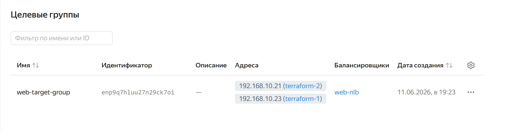
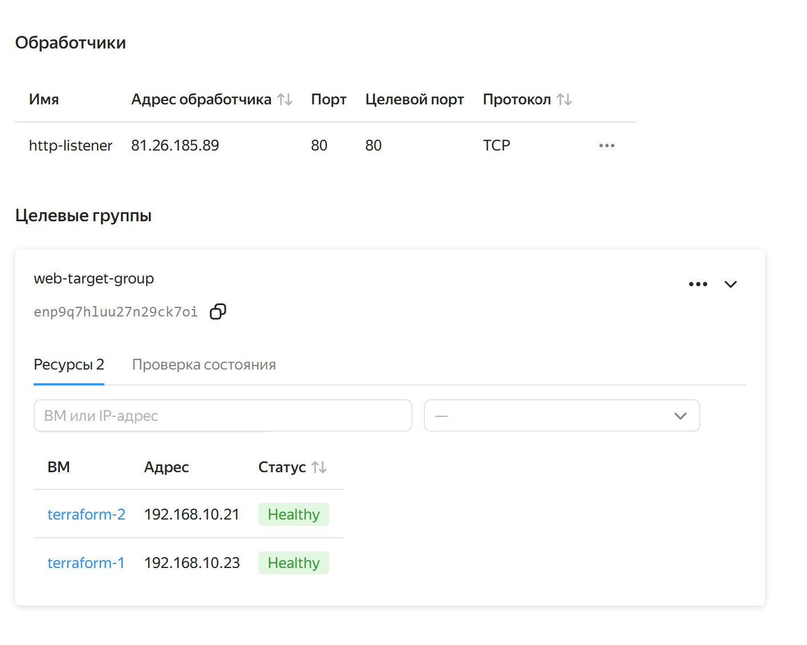
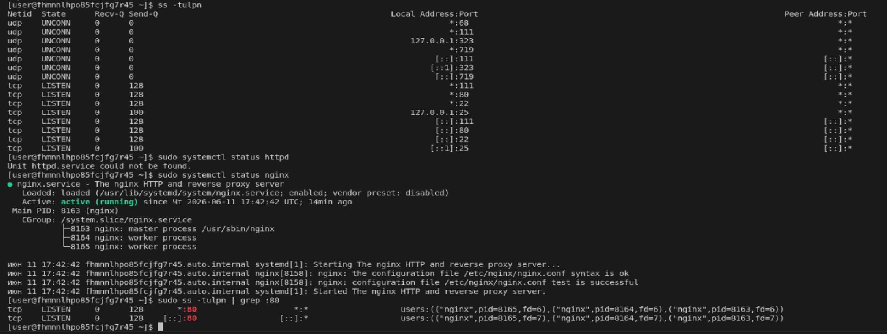
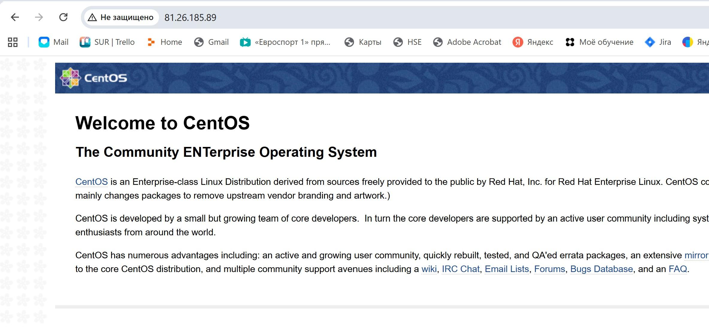

# Домашнее задание к занятию "Отказоустойчивость в облаке" - Борис Горелик

### Задание 1

(./cloud-init.yml)
(./hosts.ini)
(./main.tf)
(./outputs.tf)
(./provider.tf)
(./variables.tf)
(./terraform.tfvars)

